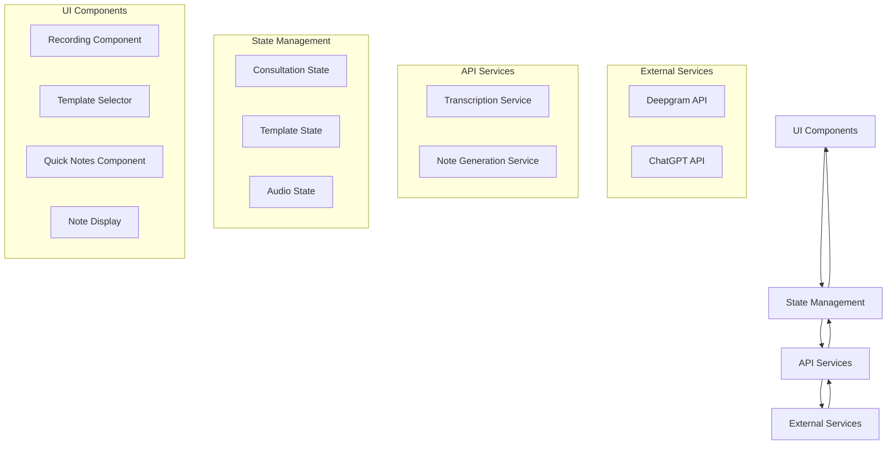
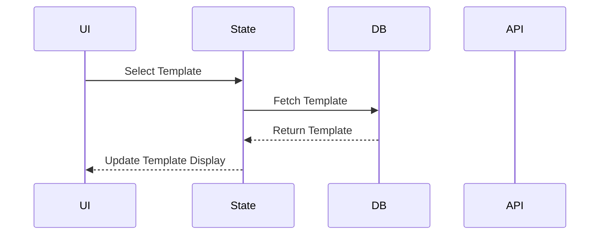
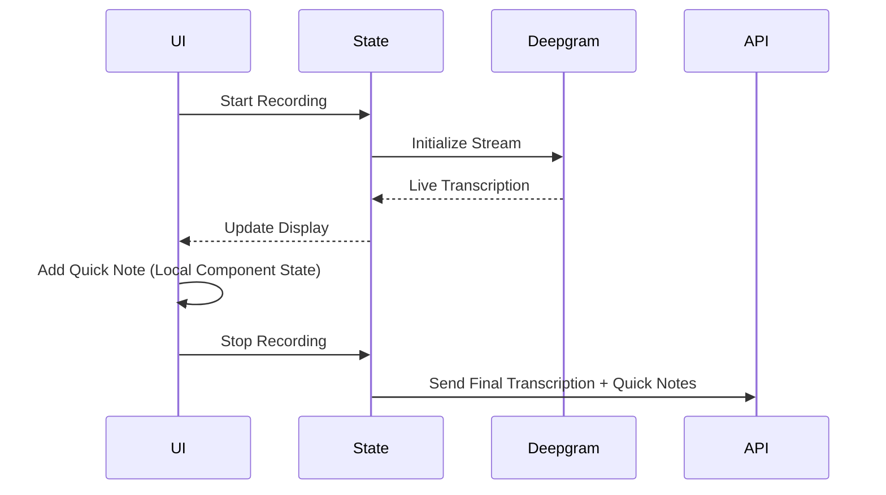
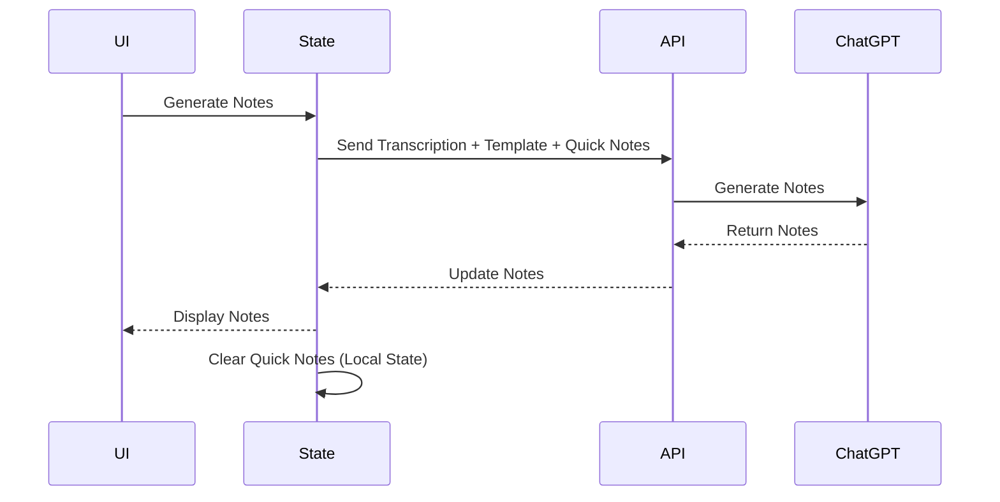

# Data Flow Design

## Overview

This document outlines the data flow architecture for ConsultAI NZ, focusing on the MVP implementation with a simple direct flow approach.

// The design follows a simple direct flow where data moves directly between components without intermediate processing layers.
// This approach is chosen for MVP to minimize complexity and latency.

## High-Level Data Flow



// The diagram shows the main components and their relationships:
// 1. UI Components: User interface elements that interact with the user
// 2. State Management: Manages the application state using React Context
// 3. API Services: Handles communication with external services
// 4. External Services: Third-party APIs (Deepgram and ChatGPT)

## Core Data Paths

### 1. Template Selection Flow


// This flow shows how templates are selected and loaded:
// 1. User selects a template in the UI
// 2. State management fetches the template from the database
// 3. Template data is stored in state
// 4. UI updates to show the selected template

### 2. Recording & Transcription Flow


// This flow shows the real-time transcription process:
// 1. User starts recording
// 2. Deepgram stream is initialized
// 3. Live transcription updates are sent to state
// 4. UI updates with transcription text
// 5. User can add quick notes during recording
// 6. When recording stops, final transcription and quick notes are sent to API

### 3. Note Generation Flow


// This flow shows how notes are generated:
// 1. User requests note generation
// 2. Current transcription, template, and quick notes are sent to API
// 3. API sends data to ChatGPT
// 4. Generated notes are returned and displayed

## Data Structures

### 1. Audio State
```typescript
type AudioState = {
  isRecording: boolean; // Whether audio is being recorded
  transcription: {
    content: string; // The transcribed text
    isLive: boolean; // Whether transcription is in progress
  };
  quickNotes: string[]; // Local state only, cleared on new consultation
  error: string | null; // Any error that occurs
};
```

### 2. Note Generation Request
```typescript
type NoteGenerationRequest = {
  transcription: string; // The complete transcription text
  templateId: string; // ID of the selected template
  template: Template; // Full template data for prompt generation
  quickNotes: string[]; // Local state notes, not persisted
};
```

### 3. Note Generation Response
```typescript
type NoteGenerationResponse = {
  notes: string; // The generated medical notes
  status: 'success' | 'error'; // Operation status
  error?: string; // Error message if status is 'error'
};
```

## API Endpoints

### 1. Note Generation
```typescript
// POST /api/generate-notes // Generate notes from transcription
// Request: NoteGenerationRequest
// Response: NoteGenerationResponse
```

## Error Handling

### 1. API Errors
```typescript
type ApiError = {
  code: string; // Error code for programmatic handling
  message: string; // User-friendly error message
  details?: any; // Additional error details
};
```

### 2. Error Recovery
- Network errors: Automatic retry (max 3 attempts) // Handles temporary network issues
- API errors: Display user-friendly message // Shows clear error messages to users
- Session recovery: Maintain state in localStorage // Prevents data loss on page refresh

## Future Considerations (Option 2)

### 1. Processing Layer
```typescript
type ProcessingLayer = {
  // Data validation
  validateData: (data: any) => ValidationResult;

  // Data transformation
  transformData: (data: any) => TransformedData;

  // Error handling
  handleError: (error: Error) => ErrorResponse;

  // Monitoring
  logActivity: (activity: Activity) => void;
};
```

### 2. Middleware Components
- Request validation
- Response transformation
- Rate limiting
- Caching
- Logging
- Monitoring

### 3. Scalability Features
- Message queues for high load
- Distributed processing
- Load balancing
- Caching strategies

## Implementation Notes

1. **Performance Optimization**
   - Minimize state updates
   - Optimize API calls
   - Use efficient data structures
   - Implement proper cleanup

2. **Testing Strategy**
   - Unit tests for data transformations
   - Integration tests for API calls
   - E2E tests for user flows

3. **Monitoring**
   - Basic error tracking
   - Performance metrics
   - User activity logging

## References

For detailed information about:
- State Management: See [state-management.md](./state-management.md)
- Template System: See [template-prompt-system.md](./template-prompt-system.md)
- User Flows: See [user-flows.md](./user-flows.md)
- Logic Flows: See [logic-flows.md](./logic-flows.md)
