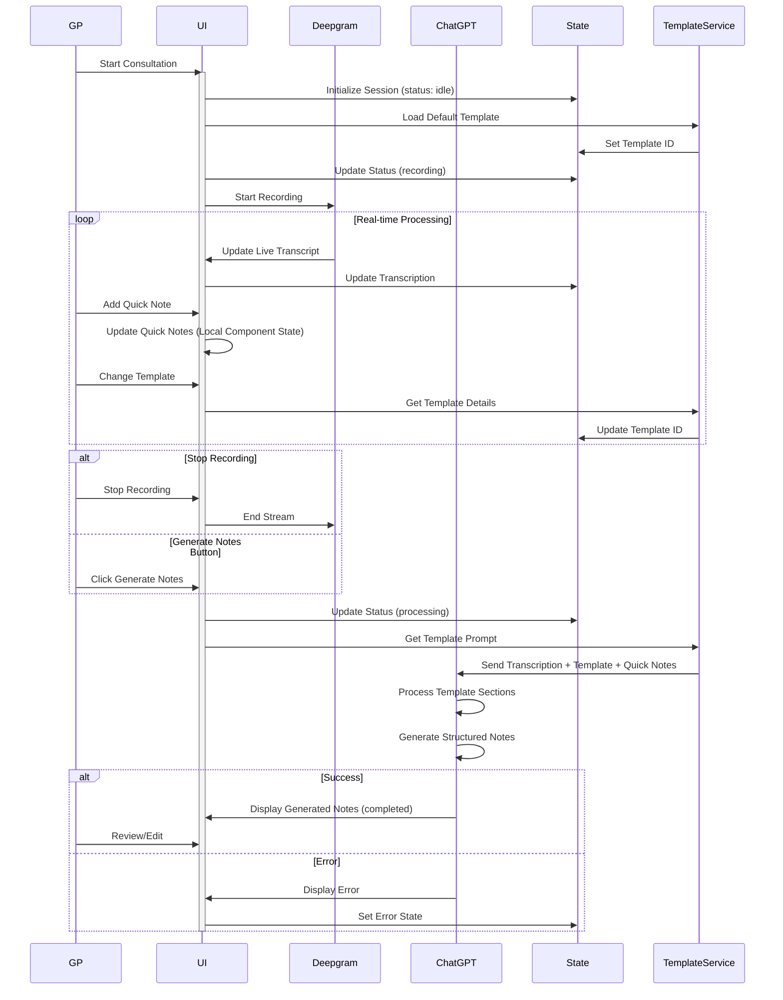
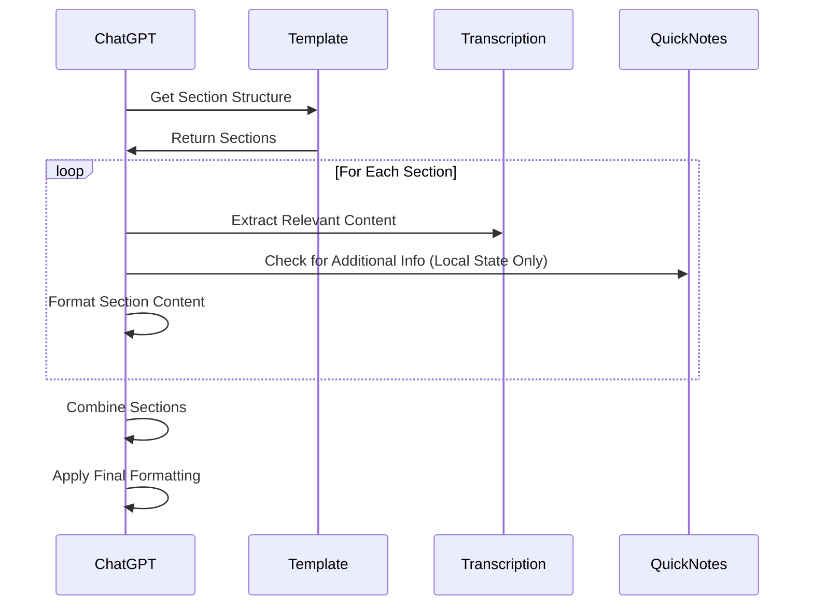
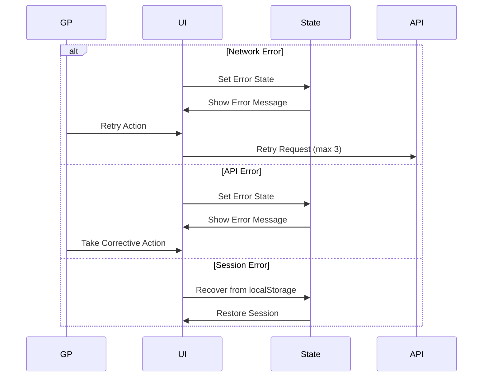

# Logic Flows

This document outlines the core system interactions and data flows in ConsultAI NZ. It focuses on how different components interact during a consultation session.

> Note: For detailed template structure, see [template-prompt-system.md](./template-prompt-system.md). For state management details, see [state-management.md](./state-management.md).

## Main Consultation Flow

## Template Section Processing

## Error Recovery Flow

