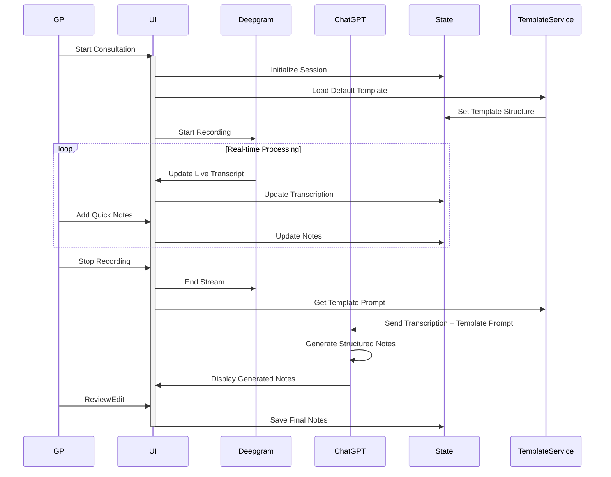

# Logic Flows

This document outlines the core system interactions and data flows in ConsultAI NZ. It focuses on how different components interact during a consultation session.

## Main Consultation Flow



## Core Components Interaction

### 1. Unified State Management
```typescript
type ConsultationState = {
  status: 'idle' | 'recording' | 'processing' | 'reviewing';
  transcription: {
    content: string;
    isLive: boolean;
  };
  quickNotes: string[];
  finalNotes: string;
  template: {
    id: string;
    name: string;
    type: 'default' | 'custom';
    structure: TemplateStructure;
    ownerId?: string; // for custom templates
  };
};

type TemplateStructure = {
  sections: {
    name: string;
    required: boolean;
    type: 'text' | 'array';
    subsections?: TemplateStructure[];
  }[];
};
```

- **State Transitions**:
  - `idle` → `recording`: Start consultation
  - `recording` → `processing`: Stop recording
  - `processing` → `reviewing`: Notes generated
  - `reviewing` → `idle`: Session completed

### 2. Real-time Processing
```typescript
type RealTimeProcessor = {
  audioStream: MediaStream;
  deepgram: DeepgramService;
  templateManager: TemplateService;

  processAudio: () => Promise<void>;
  updateUI: (state: ConsultationState) => void;
  handleQuickNote: (note: string) => void;
  handleTemplateChange: (templateId: string) => Promise<void>;
};
```

- **Processing Pipeline**:
  - Audio capture
  - Real-time transcription
  - UI updates
  - Template management

### 3. Template System

#### Template Service
```typescript
type TemplateService = {
  getDefaultTemplates: () => Promise<Template[]>;
  getUserTemplates: (userId: string) => Promise<Template[]>;
  createTemplate: (template: Omit<Template, 'id'>) => Promise<Template>;
  updateTemplate: (template: Template) => Promise<Template>;
  deleteTemplate: (templateId: string) => Promise<void>;
  generatePrompt: (template: Template, transcription: string) => string;
};

type Template = {
  id: string;
  name: string;
  type: 'default' | 'custom';
  structure: TemplateStructure;
  ownerId?: string;
  createdAt: Date;
  updatedAt: Date;
};
```

#### Prompt Generation
```typescript
type PromptGenerator = {
  generatePrompt: (template: Template, transcription: string) => string;
  formatSection: (section: TemplateStructure) => string;
  formatArraySection: (section: TemplateStructure) => string;
};
```

### 4. AI Services

#### Deepgram Integration
```typescript
type DeepgramService = {
  startRecording: () => Promise<void>;
  stopRecording: () => Promise<void>;
  onTranscriptionUpdate: (text: string) => void;
};
```

#### ChatGPT Integration
```typescript
type ChatGPTService = {
  generateNotes: (input: {
    transcription: string;
    quickNotes: string[];
    templatePrompt: string;
  }) => Promise<string>;
};
```

- **Features**:
  - Clinical note generation
  - Template-based structuring
  - Note formatting
w
