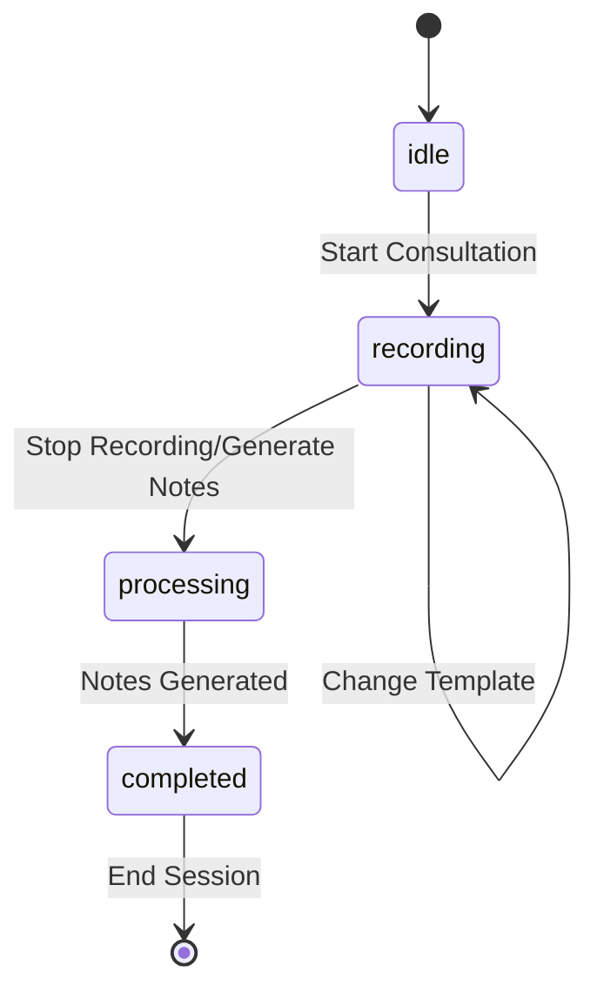

# State Management Planning

## Overview

This document outlines the state management approach for ConsultAI NZ, focusing on the MVP requirements and core consultation flow.

## Core State Structure

### 1. Global Consultation State

```typescript
type ConsultationState = {
  // Core consultation status
  status: 'idle' | 'recording' | 'processing' | 'completed';

  // Template ID - other template details can be fetched when needed
  templateId: string;

  // Transcription state
  transcription: {
    content: string;
    isLive: boolean;
  };

  // Final generated notes
  generatedNotes: string | null;

  // Any error that occurs
  error: string | null;
};
```

### 2. Local Audio State

```typescript
type AudioState = {
  isRecording: boolean;
  finalTranscript: string;
  interimTranscript: string;
  error: string | null;
};
```

## State Transitions

### 1. Consultation Flow



### 2. State Transition Rules

1. **idle → recording**
   - Template ID must be set
   - Audio permissions granted
   - No active errors

2. **recording → recording (Template Change)**
   - Template ID can be changed
   - Transcription continues uninterrupted
   - No active errors

3. **recording → processing**
   - Recording stopped or "Generate Notes" clicked
   - Transcription content exists
   - No active errors

4. **processing → completed**
   - Notes generated successfully
   - No active errors

## Implementation Details

### 1. Context Provider

```typescript
const ConsultationContext = createContext<{
  state: ConsultationState;
  setState: React.Dispatch<React.SetStateAction<ConsultationState>>;
} | null>(null);

function ConsultationProvider({ children }: { children: React.ReactNode }) {
  const [state, setState] = useState<ConsultationState>({
    status: 'idle',
    templateId: 'default-soap', // Default template
    transcription: {
      content: '',
      isLive: false
    },
    generatedNotes: null,
    error: null
  });

  return (
    <ConsultationContext.Provider value={{ state, setState }}>
      {children}
    </ConsultationContext.Provider>
  );
}
```

### 2. State Update Functions

```typescript
const useConsultation = () => {
  const context = useContext(ConsultationContext);
  if (!context) {
    throw new Error('useConsultation must be used within ConsultationProvider');
  }

  const { state, setState } = context;

  const startConsultation = () => {
    setState(prev => ({
      ...prev,
      status: 'recording',
      error: null
    }));
  };

  const changeTemplate = (templateId: string) => {
    setState(prev => ({
      ...prev,
      templateId,
      error: null
    }));
  };

  const stopConsultation = () => {
    setState(prev => ({
      ...prev,
      status: 'processing',
      error: null
    }));
  };

  const completeConsultation = (notes: string) => {
    setState(prev => ({
      ...prev,
      status: 'completed',
      generatedNotes: notes,
      error: null
    }));
  };

  const setError = (error: string) => {
    setState(prev => ({
      ...prev,
      error
    }));
  };

  return {
    state,
    startConsultation,
    changeTemplate,
    stopConsultation,
    completeConsultation,
    setError
  };
};
```

## State Management Guidelines

### 1. State Updates
- Always use the provided state update functions
- Never modify state directly
- Keep state updates atomic
- Handle errors appropriately

### 2. State Access
- Use the `useConsultation` hook to access state
- Access state only in components that need it
- Avoid prop drilling (passing props through multiple components that don't use them)

### 3. Error Handling
- Set error state when operations fail
- Clear error state when operations succeed
- Display errors to users appropriately

### 4. Performance Considerations
- Keep state updates minimal
- Use memoization where appropriate
- Avoid unnecessary re-renders

## Testing Strategy

### 1. State Transitions
- Test all valid state transitions
- Test template changes during recording
- Test invalid state transitions
- Test error states

### 2. State Updates
- Test state update functions
- Test error handling
- Test edge cases

### 3. Integration Tests
- Test state with audio recording
- Test state with note generation
- Test state with template changes

## Future Considerations

### 1. State Persistence
- Consider adding state persistence for MVP
- Evaluate storage options (localStorage, IndexedDB)
- Plan for data cleanup

### 2. State Optimization
- Monitor state performance
- Identify optimization opportunities
- Plan for state refactoring

### 3. State Expansion
- Plan for additional states
- Consider state modularization
- Evaluate state management alternatives
