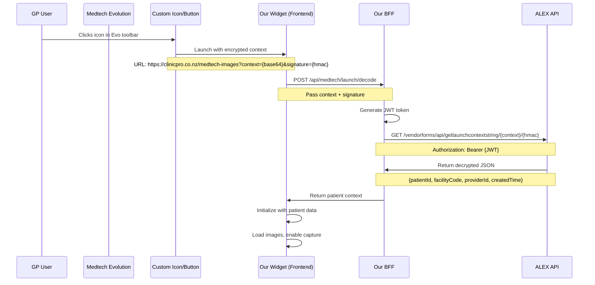

# Launch Mechanism Implementation Plan

**Created**: 2026-01-11  
**Status**: Planning  
**Source**: Defne (Medtech ALEX Support) email on 2026-01-11

## Overview

Medtech Evolution uses ALEX Vendor Forms launch mechanism to securely pass patient context to third-party vendor forms (our widget). This is the **proper integration method** for launching our clinical images widget from within Medtech Evolution.

## How It Works



## What We Get From Launch Context

When Medtech launches our widget, we receive:
- `patientId`: Internal patient identifier (encrypted)
- `facilityCode`: Facility ID (e.g., `F99669-C`)
- `providerId`: Provider/GP identifier
- `createdTime`: Timestamp of context creation

**Note**: `patientId` will be `null` if no patient is in the pallet (patient not selected).

## Implementation Steps

### Phase 1: Setup in Medtech Evolution (One-time)

**Goal**: Configure our widget as a launchable ALEX app in Medtech Evolution

#### 1.1 Create and Load Icon
- Create icon image file (PNG, recommended size: 32x32 or 64x64)
- Name the file descriptively (e.g., `ClinicPro-Images.png`)
- Open Medtech Evolution
- Navigate to: **Utilities > MT Icon Loader**
- Place icon in a folder
- Browse to folder and import icon into database
- **The folder name becomes the display name in toolbar**

#### 1.2 Configure ALEX App
- Navigate to: **Options > ALEX > ALEX Apps Configuration**
- Click "New" or "Add"
- Fill in configuration:
  - **Icon**: Select our imported icon from dropdown
  - **Description**: "ClinicPro Clinical Images"
  - **Launch**: Our widget URL with launch parameters (see below)
  - **Mode**: Web Browser (launches in browser, not embedded)
  - **Display Screen Selection**: Check "Patient Manager" (launches from patient context)

#### 1.3 Generate Launch URL
Our widget launch URL format:
```
https://www.clinicpro.co.nz/medtech-images/launch?context={context}&signature={signature}
```

Medtech Evolution will replace `{context}` and `{signature}` with encrypted values.

---

### Phase 2: Backend Implementation (BFF)

**Goal**: Implement endpoint to decode launch context from Medtech

#### 2.1 Create Launch Decode Endpoint

**File**: `lightsail-bff/index.js`

**New endpoint**: `GET /api/medtech/launch/decode`

**Query parameters**:
- `context`: Base64 encoded encrypted launch context
- `signature`: HMAC signature

**Implementation**:
```javascript
app.get('/api/medtech/launch/decode', async (req, res) => {
  const { context, signature } = req.query
  const correlationId = randomUUID()
  const startTime = Date.now()
  
  try {
    // Validate parameters
    if (!context || !signature) {
      return res.status(400).json({
        success: false,
        error: 'context and signature parameters required',
        correlationId,
      })
    }
    
    // Generate JWT token for ALEX API
    const tokenInfo = oauthTokenService.getTokenInfo()
    
    // Call ALEX to decrypt launch context
    const launchContext = await alexApiClient.get(
      `/vendorforms/api/getlaunchcontextstring/${context}/${signature}`,
      { correlationId }
    )
    
    // launchContext = { patientId, facilityCode, providerId, createdTime }
    
    res.json({
      success: true,
      duration: Date.now() - startTime,
      correlationId,
      context: launchContext,
    })
  } catch (error) {
    res.status(error?.statusCode || 500).json({
      success: false,
      error: error instanceof Error ? error.message : 'Unknown error',
      correlationId,
      duration: Date.now() - startTime,
    })
  }
})
```

**Testing**:
- Manual test with Postman using sample context/signature from Medtech
- Verify JWT token validation works
- Verify response includes all expected fields

---

### Phase 3: Frontend Implementation (Widget)

**Goal**: Handle launch from Medtech Evolution

#### 3.1 Create Launch Route

**New route**: `/medtech-images/launch`

**File**: `app/(medtech)/medtech-images/launch/page.tsx`

**Implementation**:
```typescript
'use client'

import { useEffect, useState } from 'react'
import { useSearchParams, useRouter } from 'next/navigation'

export default function LaunchPage() {
  const searchParams = useSearchParams()
  const router = useRouter()
  const [error, setError] = useState<string | null>(null)
  
  useEffect(() => {
    const context = searchParams.get('context')
    const signature = searchParams.get('signature')
    
    if (!context || !signature) {
      setError('Missing launch parameters')
      return
    }
    
    // Decode launch context via BFF
    fetch(`/api/medtech/launch/proxy?context=${context}&signature=${signature}`)
      .then(res => res.json())
      .then(data => {
        if (data.success) {
          const { patientId, facilityCode, providerId } = data.context
          
          // Redirect to main widget with resolved parameters
          router.push(
            `/medtech-images?` +
            `patientId=${patientId}&` +
            `facilityId=${facilityCode}&` +
            `providerId=${providerId}&` +
            `encounterId=launch-${Date.now()}`
          )
        } else {
          setError(data.error || 'Failed to decode launch context')
        }
      })
      .catch(err => {
        setError(err.message || 'Network error')
      })
  }, [searchParams, router])
  
  if (error) {
    return <div>Error: {error}</div>
  }
  
  return <div>Loading patient context...</div>
}
```

#### 3.2 Create Vercel Proxy Endpoint

**File**: `app/api/medtech/launch/proxy/route.ts`

**Why**: Proxy BFF call through Vercel to avoid CORS issues

```typescript
import { NextRequest, NextResponse } from 'next/server'

const BFF_URL = process.env.BFF_URL || 'https://api.clinicpro.co.nz'

export async function GET(request: NextRequest) {
  const searchParams = request.nextUrl.searchParams
  const context = searchParams.get('context')
  const signature = searchParams.get('signature')
  
  if (!context || !signature) {
    return NextResponse.json(
      { success: false, error: 'Missing parameters' },
      { status: 400 }
    )
  }
  
  try {
    const response = await fetch(
      `${BFF_URL}/api/medtech/launch/decode?context=${context}&signature=${signature}`
    )
    
    const data = await response.json()
    return NextResponse.json(data, { status: response.status })
  } catch (error) {
    return NextResponse.json(
      { success: false, error: 'BFF request failed' },
      { status: 500 }
    )
  }
}
```

---

### Phase 4: Testing

#### 4.1 Local Testing (F99669-C)

**Prerequisites**:
- Icon loaded in Medtech Evolution database
- ALEX App configured with launch URL pointing to localhost or preview deployment
- Windows desktop awake (Hybrid Connection Manager running)

**Test steps**:
1. Open Medtech Evolution
2. Login and select test patient (NHI: ZZZ0016)
3. Click our custom icon in toolbar
4. Verify: Browser opens with widget
5. Verify: Widget loads with correct patient context
6. Upload and commit test image
7. Verify: Image appears in Medtech Inbox/Daily Record

#### 4.2 Production Testing

**Test in production environment**:
- Update ALEX App configuration to use production URL
- Test with real patient data
- Verify end-to-end flow

---

## Impact on Current Implementation

### What Changes
- ✅ **Launch mechanism**: Properly integrated via ALEX Vendor Forms
- ✅ **Security**: Medtech encrypts and signs launch context
- ✅ **Patient context**: Automatically passed by Medtech (no manual URL construction)
- ✅ **Provider context**: We now know which GP is using the widget

### What Stays the Same
- ✅ **Commit flow**: Widget → Vercel → BFF → ALEX POST /Media
- ✅ **Image storage**: Redis + S3 session management
- ✅ **Mobile flow**: QR code + mobile upload
- ✅ **Widget UI**: No changes needed (still accepts patientId/facilityId params)

### What's Deferred
- ⏸️ **UI integration issue**: Still need to resolve broken links in Inbox/Daily Record
- ⏸️ **Email to Medtech**: May need to ask about Media resource structure separately

---

## Documentation Updates Needed

1. **PROJECT_SUMMARY.md**:
   - Add launch mechanism section
   - Update "Next Session" with launch implementation priority

2. **DEVELOPMENT_ROADMAP.md**:
   - Update Phase 1D with launch mechanism tasks
   - Add Phase 2 (if needed) for launch implementation

3. **LOG.md**:
   - Add 2026-01-11 entry about launch mechanism guidance from Defne

4. **CURRENT-WORK.md**:
   - Update top priority to implement launch mechanism
   - Update active queue

---

## Timeline Estimate

**Total: 4-6 hours**

- Phase 1 (Medtech setup): 30 minutes
- Phase 2 (BFF endpoint): 1-2 hours
- Phase 3 (Frontend/proxy): 1-2 hours
- Phase 4 (Testing): 1-2 hours

---

## Next Immediate Actions

1. **Create icon image** for ClinicPro Images
2. **Implement BFF launch decode endpoint**
3. **Implement frontend launch route and proxy**
4. **Test locally** with F99669-C
5. **Deploy to production**
6. **Document results**

---

## Open Questions

1. **UI Integration**: Do we still need to resolve the broken link issue in Inbox? Or does proper launch mechanism fix this?
2. **Daily Record**: Will images appear in Daily Record automatically once we use proper launch?
3. **Icon design**: What size/format does Medtech prefer for toolbar icons?
4. **Launch modes**: Should we support "ALEX Apps Workspace" or "Dashboard" modes, or stick with "Web Browser"?

---

## References

- Defne's email: 2026-01-11 (launch mechanism instructions + attached document)
- ALEX Vendor Forms documentation (reference in email)
- Screenshots: Medtech Evolution MT Icon Loader, ALEX Apps Configuration screen
